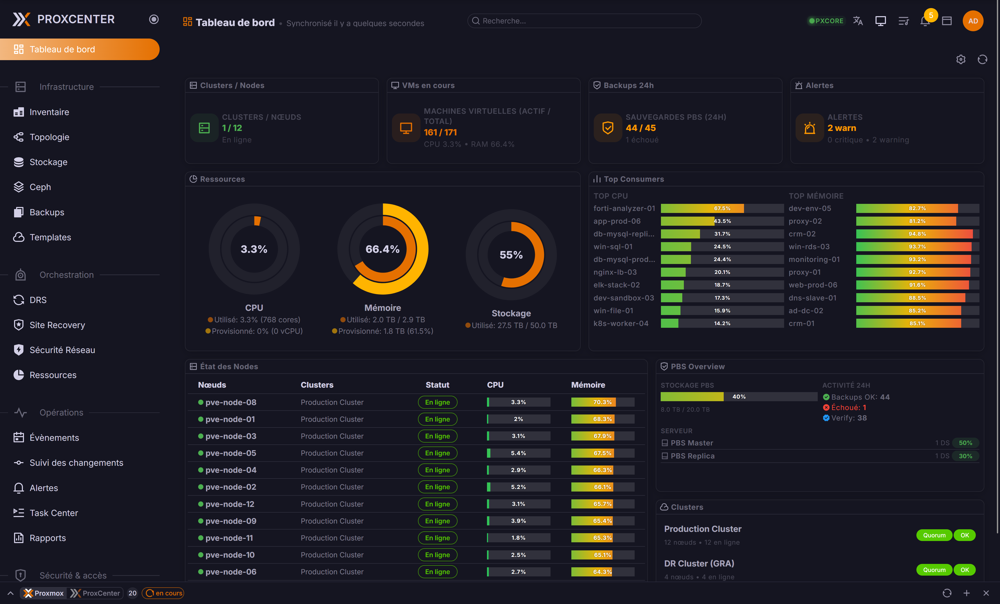

<p align="center">
  <picture>
    <source media="(prefers-color-scheme: dark)" srcset="docs/logo-dark.svg">
    <source media="(prefers-color-scheme: light)" srcset="docs/logo.svg">
    
  </picture>
</p>

<h1 align="center">ProxCenter - Community Edition</h1>

<p align="center">
  <a href="https://www.proxcenter.io/">www.proxcenter.io</a> · <a href="https://demo.proxcenter.io/">Live Demo</a> · <a href="https://docs.proxcenter.io/">Documentation</a>
</p>

<p align="center">
  <strong>The open alternative for Proxmox Virtual Environment management</strong>
</p>

<p align="center">
  
  
  <a href="https://github.com/adminsyspro/proxcenter-ui/actions/workflows/codeql.yml"></a>
  <a href="https://github.com/adminsyspro/proxcenter-ui/actions/workflows/security-scan.yml"></a>
  <a href="https://github.com/adminsyspro/proxcenter-ui/stargazers"></a>
</p>

<p align="center">
  <a href="https://sonarcloud.io/summary/overall?id=adminsyspro_proxcenter-ui"></a>
  <a href="https://sonarcloud.io/summary/overall?id=adminsyspro_proxcenter-ui"></a>
  <a href="https://sonarcloud.io/summary/overall?id=adminsyspro_proxcenter-ui"></a>
</p>

---

## Overview

**ProxCenter** is a modern web interface for monitoring and managing Proxmox VE infrastructure. Multi-cluster management, cross-hypervisor migration, and centralized monitoring — from a single pane of glass.

<p align="center">
  
</p>

---

## Quick Start (Docker)

```bash
# Clone the repository
git clone https://github.com/walid/proxcenter-ui-enhanced.git
cd proxcenter-ui-enhanced

# Copy environment variables
cp .env.example .env

# Start the stack
docker compose -f docker-compose.community.yml up -d
```

---

## Architecture

<p align="center">
  
</p>

- **Single port** (3000) — HTTP + WebSocket from one process
- **Nginx optional** — SSL termination + reverse proxy
- **Lightweight** — Focused on essential management and monitoring

---

## Configuration

After install, ProxCenter runs at `http://your-server:3000`.

Files in current directory:
- `.env` — Environment variables
- `docker-compose.community.yml` — Service definition

**Reverse proxy**: Enable the *"Behind reverse proxy"* toggle in connection settings to prevent failover from switching to internal node IPs.

```bash
docker compose logs -f          # View logs
docker compose pull && docker compose up -d  # Update
docker compose restart          # Restart
```

---

## Requirements

- Docker & Docker Compose
- Proxmox VE 8.x or 9.x
- Network access to Proxmox API (port 8006)

## Security

Automated scanning via **CodeQL**, **Trivy**, and **Dependabot**. Report vulnerabilities to [security@proxcenter.io](mailto:security@proxcenter.io).

## License

- **Community**: Free for personal and commercial use (MIT-style for this enhanced fork)

## Support

- [GitHub Issues](https://github.com/adminsyspro/proxcenter-ui/issues)
